<!-- ===================================================================== -->
<!-- HERO SECTION                                                          -->
<!-- ===================================================================== -->

  

    

  <h1>Hi, I'm Maxime 👋</h1>

  

    <strong>Software • Networks • Backend • Security</strong>
  

  <!-- Animated Typing SVG -->
  

    
  

  

    <em>Building software from web applications to network protocols and security tooling.</em>
  

  

    
    
    
    
  

 

---

<!-- ===================================================================== -->
<!-- ABOUT ME SECTION                                                      -->
<!-- ===================================================================== -->

## ⚡ About Me

- 🎓 Computer Science & Networking student (**BTS CIEL option Informatique & Réseaux**).
- ⚙️ Focused on **Backend Architecture**, **Distributed Systems**, **Network Protocols**, and **Security Engineering**.
- 🛠️ Engineering philosophy: local-first design, deterministic state engines, decoupled queues, and rigorous automated test coverage.
- 📍 Based in France.

 

---

<!-- ===================================================================== -->
<!-- SELECTED WORK / PROJECTS & EXPERIMENTS                                -->
<!-- ===================================================================== -->

## 🚀 Projects & Experiments

> A curated selection of systems, network tools, and security platforms built across public and private engineering repositories.

<table width="100%">
<tr>
<td width="50%" valign="top">

<h3>🔍 Local OSINT Investigation Engine</h3>

Local-first personal digital footprint audit and identity correlation platform engineered with zero cloud dependencies.

<ul>
<li><strong>Architecture:</strong> Adaptive investigation engine with atomic budget reservation, formal action state machines, and loop-prevention heuristics.</li>
<li><strong>Security:</strong> Tamper-evident hash chain preserving audit integrity and source reliability scoring.</li>
<li><strong>Quality:</strong> <strong>700+ automated tests</strong> (100% pass rate).</li>
</ul>

<em>Source: Private Repository</em>

</td>
<td width="50%" valign="top">

<h3>🌐 MineScope — Distributed Telemetry</h3>

High-throughput discovery, DNS SRV resolution, and real-time Server List Ping (SLP) monitoring platform.

<ul>
<li><strong>Pipeline:</strong> Asynchronous discovery engine with intelligent SRV fallback and binary SLP protocol handshake parser.</li>
<li><strong>Throughput:</strong> Decoupled ingestion with <strong>Redis BullMQ worker pools</strong> feeding PostgreSQL storage.</li>
<li><strong>Interface:</strong> Live analytics dashboard with sub-millisecond status polling and MOTD rich-text rendering.</li>
</ul>

<em>Source: Private Repository</em>

</td>
</tr>
<tr>
<td width="50%" valign="top">

<h3>🛡️ Cyber Posture Assessment Platform</h3>

Automated network exposure evaluation platform performing credentialed audits on explicitly authorized network scopes.

<ul>
<li><strong>Engine:</strong> Rule-based detection against <strong>22 security rules</strong> (Telnet, SMB, Redis, MySQL exposed interfaces).</li>
<li><strong>Audit Diff:</strong> Automated differential analysis comparing successive scans to track port exposure drift.</li>
<li><strong>Security:</strong> Weighted posture scoring algorithm (0–100), JWT role-based access, and PDF/HTML audit reports.</li>
</ul>

<em>Source: Private Repository</em>

</td>
<td width="50%" valign="top">

<h3>📡 Cirpark UDP Sniffer & Telemetry</h3>

Low-level network telemetry platform capturing and decoding raw UDP datagrams from parking sensor networks.

<ul>
<li><strong>Networking:</strong> Custom <strong>C++ UDP socket listener</strong> capturing binary sensor frames in real time.</li>
<li><strong>Telemetry:</strong> Live packet decoding, state synchronization, and historical occupancy tracking.</li>
<li><strong>Dashboard:</strong> Event-driven web interface providing instant sensor status visualization.</li>
</ul>

<em>Source: Private Repository</em>

</td>
</tr>
<tr>
<td colspan="2" valign="top">

<h3>⚡ DevPulse — Network Latency & Ping Dashboard</h3>

Zero-dependency, client-side endpoint availability monitor and real-time HTTP latency testing interface.

<ul>
<li><strong>Measurement:</strong> Real-time fetch latency measurement with dark-themed reactive UI.</li>
<li><strong>Design:</strong> Built with pure Vanilla web technologies for instant execution without build tooling or dependencies.</li>
</ul>

&nbsp;&nbsp;
<a href="https://github.com/Clickdroit/dashboard"><strong>View Public Repository →</strong></a>

</td>
</tr>
</table>

 

---

<!-- ===================================================================== -->
<!-- TECH STACK SECTION                                                    -->
<!-- ===================================================================== -->

## 🛠️ Tech Stack

  

  

    <code>DNS SRV Protocols</code> •
    <code>UDP Socket Programming</code> •
    <code>Nmap Network Auditing</code> •
    <code>Wireshark Packet Analysis</code> •
    <code>Prisma ORM</code> •
    <code>BullMQ Distributed Queues</code> •
    <code>Pytest &amp; Jest</code>
  

 

---

<!-- ===================================================================== -->
<!-- ENGINEERING FOCUS SECTION                                             -->
<!-- ===================================================================== -->

## 🧠 Engineering Focus

<table width="100%">
  <tr>
    <td width="33%" align="center" valign="top">
      <h4>⚡ Distributed Systems</h4>
      
Decoupled asynchronous worker queues (BullMQ / Redis), high-concurrency event loops, and resilient background task processing.

    </td>
    <td width="33%" align="center" valign="top">
      <h4>🛰️ Networking &amp; Protocols</h4>
      
Low-level UDP socket programming, custom binary protocol decoding, DNS SRV record resolution, and latency benchmarking.

    </td>
    <td width="33%" align="center" valign="top">
      <h4>🔒 Defensive Security</h4>
      
Rule-based port scanning heuristics, local-first OSINT engines, automated posture scoring, and tamper-evident hash validation.

    </td>
  </tr>
</table>

 

---

<!-- ===================================================================== -->
<!-- GITHUB ACTIVITY & METRICS                                             -->
<!-- ===================================================================== -->

## 📊 Activity & Contributions

  <table border="0">
    <tr>
      <td>
        
      </td>
      <td>
        
      </td>
    </tr>
  </table>

 

<!-- ===================================================================== -->
<!-- CONTRIBUTION CALENDAR ANIMATION (PROGRESSIVE APPEARANCE)              -->
<!-- ===================================================================== -->

### 📈 Contribution History

  

 

---

<!-- ===================================================================== -->
<!-- CONNECT / CONTACT SECTION                                             -->
<!-- ===================================================================== -->

## 🌐 Connect

  
  &nbsp;&nbsp;
  
  &nbsp;&nbsp;
  

 
